# Meridian Database Schema — ER Diagram

```mermaid
erDiagram
    %% ==========================================
    %% CORE / AUTH
    %% ==========================================
    users {
        BIGINT id PK
        VARCHAR email UK
        VARCHAR password
        VARCHAR username UK
        VARCHAR name
        VARCHAR role
        BOOLEAN is_active
        VARCHAR avatar_url
        VARCHAR timezone
        VARCHAR language
        DATETIME created_at
        DATETIME updated_at
        DATETIME deleted_at
    }

    sessions {
        BIGINT id PK
        BIGINT user_id FK
        VARCHAR refresh_token UK
        VARCHAR device_info
        VARCHAR ip_address
        DATETIME expires_at
        DATETIME revoked_at
        DATETIME created_at
    }

    %% ==========================================
    %% SUBSCRIPTION
    %% ==========================================
    subscription_plans {
        BIGINT id PK
        VARCHAR name
        VARCHAR code UK
        TEXT description
        NUMERIC price_monthly
        NUMERIC price_yearly
        JSONB features
        BOOLEAN is_active
        DATETIME created_at
        DATETIME updated_at
    }

    user_subscriptions {
        BIGINT id PK
        BIGINT user_id FK
        BIGINT plan_id FK
        VARCHAR status
        DATETIME trial_ends_at
        DATETIME current_period_start
        DATETIME current_period_end
        BOOLEAN cancel_at_period_end
        DATETIME canceled_at
        VARCHAR stripe_customer_id
        VARCHAR stripe_subscription_id
        DATETIME created_at
        DATETIME updated_at
    }

    subscription_usage {
        BIGINT id PK
        BIGINT user_id FK
        VARCHAR feature_key
        INT usage_count
        DATETIME period_start
        DATETIME period_end
    }

    %% ==========================================
    %% WATER
    %% ==========================================
    water_goals {
        BIGINT id PK
        BIGINT user_id FK
        INT daily_goal_ml
        INT reminder_interval_minutes
        BOOLEAN reminder_enabled
        DATETIME created_at
        DATETIME updated_at
    }

    water_logs {
        BIGINT id PK
        BIGINT user_id FK
        INT amount_ml
        DATETIME logged_at
        DATETIME created_at
    }

    %% ==========================================
    %% TODOS
    %% ==========================================
    todos {
        BIGINT id PK
        BIGINT user_id FK
        VARCHAR title
        TEXT description
        VARCHAR status
        VARCHAR priority
        DATETIME due_date
        DATETIME completed_at
        VARCHAR recurrence_rule
        BIGINT parent_id FK
        INT position
        DATETIME created_at
        DATETIME updated_at
        DATETIME deleted_at
    }

    todo_tags {
        BIGINT id PK
        BIGINT user_id FK
        VARCHAR name
        VARCHAR color
        DATETIME created_at
    }

    todo_tag_links {
        BIGINT todo_id PK,FK
        BIGINT tag_id PK,FK
    }

    %% ==========================================
    %% REMINDERS
    %% ==========================================
    reminders {
        BIGINT id PK
        BIGINT user_id FK
        VARCHAR title
        TEXT description
        DATETIME scheduled_at
        VARCHAR timezone
        VARCHAR recurrence_rule
        VARCHAR status
        VARCHAR notification_channel
        DATETIME snooze_until
        DATETIME created_at
        DATETIME updated_at
    }

    reminder_logs {
        BIGINT id PK
        BIGINT reminder_id FK
        DATETIME fired_at
        VARCHAR action
        DATETIME snoozed_until
    }

    %% ==========================================
    %% EVENTS
    %% ==========================================
    events {
        BIGINT id PK
        BIGINT user_id FK
        VARCHAR title
        TEXT description
        VARCHAR location
        DATETIME start_at
        DATETIME end_at
        VARCHAR timezone
        BOOLEAN is_all_day
        VARCHAR recurrence_rule
        VARCHAR status
        VARCHAR visibility
        INT reminder_minutes_before
        DATETIME created_at
        DATETIME updated_at
    }

    event_attendees {
        BIGINT id PK
        BIGINT event_id FK
        BIGINT user_id FK
        VARCHAR email
        VARCHAR status
        BOOLEAN is_organizer
    }

    %% ==========================================
    %% NOTES
    %% ==========================================
    notes {
        BIGINT id PK
        BIGINT user_id FK
        VARCHAR title
        TEXT content
        VARCHAR format
        BOOLEAN is_pinned
        VARCHAR color
        DATETIME created_at
        DATETIME updated_at
        DATETIME deleted_at
    }

    %% ==========================================
    %% FOOD
    %% ==========================================
    food_scans {
        BIGINT id PK
        BIGINT user_id FK
        VARCHAR image_url
        JSONB predictions
        VARCHAR status
        DATETIME created_at
    }

    food_items {
        BIGINT id PK
        BIGINT user_id FK
        BIGINT scan_id FK
        VARCHAR name
        VARCHAR brand
        VARCHAR barcode
        VARCHAR openfoodfacts_code
        NUMERIC serving_size_g
        NUMERIC calories
        NUMERIC protein_g
        NUMERIC carbs_g
        NUMERIC fat_g
        NUMERIC fiber_g
        NUMERIC sugar_g
        NUMERIC sodium_mg
        JSONB nutrition_json
        DATETIME logged_at
    }

    %% ==========================================
    %% SHARED
    %% ==========================================
    attachments {
        BIGINT id PK
        BIGINT user_id FK
        VARCHAR entity_type
        BIGINT entity_id
        VARCHAR file_url
        VARCHAR file_type
        BIGINT file_size
        DATETIME created_at
    }

    audit_logs {
        BIGINT id PK
        BIGINT user_id FK
        VARCHAR action
        VARCHAR entity_type
        BIGINT entity_id
        JSONB old_values
        JSONB new_values
        VARCHAR ip_address
        DATETIME created_at
    }

    %% ==========================================
    %% RELATIONSHIPS
    %% ==========================================

    %% Auth
    users ||--o{ sessions : "has"
    users ||--o| user_subscriptions : "has"
    subscription_plans ||--o{ user_subscriptions : "contains"
    users ||--o{ subscription_usage : "tracks"

    %% Water
    users ||--o| water_goals : "has"
    users ||--o{ water_logs : "logs"

    %% Todos
    users ||--o{ todos : "owns"
    todos ||--o{ todos : "parent of"
    users ||--o{ todo_tags : "owns"
    todos }o--o{ todo_tags : "tagged with"

    %% Reminders
    users ||--o{ reminders : "owns"
    reminders ||--o{ reminder_logs : "fires"

    %% Events
    users ||--o{ events : "organizes"
    events ||--o{ event_attendees : "has"
    users ||--o{ event_attendees : "attends"

    %% Notes
    users ||--o{ notes : "owns"

    %% Food
    users ||--o{ food_scans : "performs"
    users ||--o{ food_items : "logs"
    food_scans ||--o{ food_items : "generates"

    %% Shared
    users ||--o{ attachments : "owns"
    users ||--o{ audit_logs : "generates"
```

## Relationship Summary

| From | To | Cardinality | Description |
|------|-----|-------------|-------------|
| `users` | `sessions` | 1:N | A user can have multiple active sessions |
| `users` | `user_subscriptions` | 1:1 | One active subscription per user |
| `subscription_plans` | `user_subscriptions` | 1:N | A plan can be subscribed to by many users |
| `users` | `subscription_usage` | 1:N | Tracks multiple feature usages per user |
| `users` | `water_goals` | 1:1 | One goal per user |
| `users` | `water_logs` | 1:N | Many logs per user |
| `users` | `todos` | 1:N | Many todos per user |
| `todos` | `todos` | 1:N | Self-referencing for subtasks (parent_id) |
| `users` | `todo_tags` | 1:N | Many tags per user |
| `todos` | `todo_tags` | M:N | Via `todo_tag_links` join table |
| `users` | `reminders` | 1:N | Many reminders per user |
| `reminders` | `reminder_logs` | 1:N | Many log entries per reminder |
| `users` | `events` | 1:N | Many events per user (organizer) |
| `events` | `event_attendees` | 1:N | Many attendees per event |
| `users` | `event_attendees` | 1:N | User can attend many events |
| `users` | `notes` | 1:N | Many notes per user |
| `users` | `food_scans` | 1:N | Many scans per user |
| `users` | `food_items` | 1:N | Many food items logged per user |
| `food_scans` | `food_items` | 1:N | One scan can produce multiple food items |
| `users` | `attachments` | 1:N | Many attachments per user (polymorphic) |
| `users` | `audit_logs` | 1:N | Many audit entries per user |

## Indexes (Recommended)

| Table | Column(s) | Type |
|-------|-----------|------|
| `sessions` | `user_id` | B-tree |
| `sessions` | `refresh_token` | Unique B-tree |
| `user_subscriptions` | `user_id` | Unique B-tree |
| `subscription_usage` | `(user_id, feature_key, period_start)` | Composite B-tree |
| `water_logs` | `(user_id, logged_at)` | Composite B-tree |
| `todos` | `(user_id, status)` | Composite B-tree |
| `todos` | `parent_id` | B-tree |
| `todo_tags` | `(user_id, name)` | Composite unique B-tree |
| `reminders` | `(user_id, scheduled_at)` | Composite B-tree |
| `events` | `(user_id, start_at)` | Composite B-tree |
| `food_items` | `(user_id, logged_at)` | Composite B-tree |
| `attachments` | `(entity_type, entity_id)` | Composite B-tree |
| `audit_logs` | `(user_id, created_at)` | Composite B-tree |
